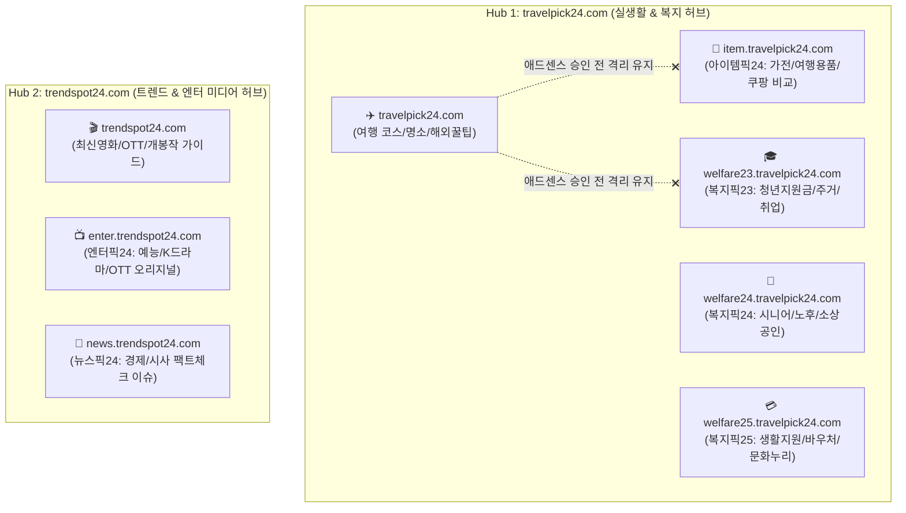
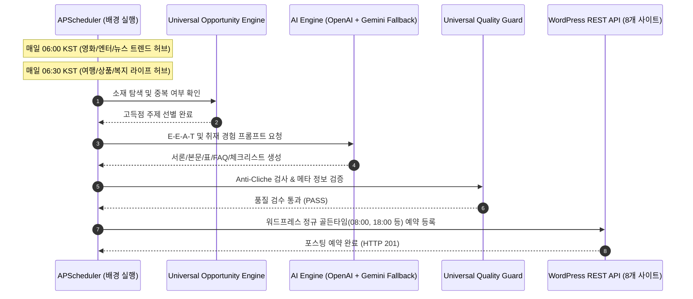

# Super Auto Blogger v3.0 통합 운영 가이드 및 상세 매뉴얼
> **8대 전문 블로그 네트워크 통합 관제 & Universal Content Quality Engine 완벽 가이드**

---

## 📌 목차 (Table of Contents)
1. [시스템 개요 및 v3.0 주요 혁신](#1-시스템-개요-및-v30-주요-혁신)
2. [8대 블로그 네트워크 토폴로지 (허브 1 & 허브 2)](#2-8대-블로그-네트워크-토폴로지-허브-1--허브-2)
3. [Command Center v3.0 대시보드 사용법](#3-command-center-v30-대시보드-사용법)
4. [Universal Content Quality & 취재 경험 엔진](#4-universal-content-quality--취재-경험-엔진)
5. [구글 애드센스 심사 및 하위도메인 격리 보호 수칙](#5-구글-애드센스-심사-및-하위도메인-격리-보호-수칙)
6. [골든타임 무인 스케줄러 및 자동 발행 메커니즘](#6-골든타임-무인-스케줄러-및-자동-발행-메커니즘)
7. [실시간 로그 콘솔 및 장애 대응/트러블슈팅](#7-실시간-로그-콘솔-및-장애-대응트러블슈팅)

---

## 1. 시스템 개요 및 v3.0 주요 혁신

**Super Auto Blogger v3.0**은 기존 단일/이중 블로그 구조에서 벗어나, 총 **8개의 독립 워드프레스 전문 블로그**를 단 하나의 중앙 관제탑에서 유기적으로 제어하는 **차세대 멀티 버티컬 자동화 플랫폼**입니다.

### 🌟 v3.0 핵심 업그레이드 내역
- **8계정 올인원 관제 센터 (Multi-Site Command Center)**: 
  - 쓰레드 x 쿠팡 자동화 대시보드(포트 8080)의 직관적인 계정 전환 및 실시간 관제 철학을 이식하였습니다.
  - 상단 8개 사이트 실시간 카드 그리드에서 원하는 사이트를 클릭하면, 즉시 해당 버티컬 전용 제어 콕핏으로 전환됩니다.
- **6대 핵심 버티컬 전면 프로덕션 가동**:
  - `MOVIE`(영화), `TRAVEL`(여행), `PRODUCT`(상품비교), `ENTERTAINMENT`(엔터), `NEWS`(뉴스 팩트체크), `WELFARE`(복지/정책) 등 6대 영역 완벽 통합.
- **버티컬별 실시간 소재 발굴기 (Universal Opportunity Service)**:
  - 블로그별로 독점적인 최신 트렌드/공공데이터/검색량 분석 기반의 `오늘의 추천 소재 TOP 5`가 매일 실시간 추천됩니다.
- **실시간 다크 터미널 콘솔 (Live Log Console)**:
  - 3초 단위 백그라운드 실시간 파이프라인 로그 스트리밍, 오류(빨강)·경고(노랑)·성공(초록)·워드프레스(하늘)·AI(보라) 컬러 코딩 및 자동 스크롤 지원.
- **원클릭 즉시 생성 & 골든타임 스케줄링**:
  - 각 블로그 카드 및 추천 소재 항목에서 [즉시생성] 버튼을 누르면 AI 작성부터 워드프레스 발행까지 백그라운드에서 한 번에 처리됩니다.

---

## 2. 8대 블로그 네트워크 토폴로지 (허브 1 & 허브 2)

전체 네트워크는 2개의 고유 메인 루트 도메인과 6개의 전용 하위도메인(Subdomain)으로 체계적으로 분할되어 검색엔진(SEO) 전문성을 극대화합니다. 모든 도메인은 **클라우드웨이즈(Cloudways) 및 호스팅케이알 DNS**로 완벽 연결되어 있으며 **Let's Encrypt 정식 SSL 보안 인증서(https)**가 적용되어 있습니다.



### 📋 사이트별 상세 명세표

| ID | 사이트 명칭 | 도메인 URL | 주력 버티컬 | 성격 및 타겟 독자 |
|---|---|---|---|---|
| **1** | **트렌드스팟24** | `https://trendspot24.com` | **MOVIE** | 최신 극장 개봉작, 넷플릭스/디즈니+ OTT 추천작, 줄거리 및 관람 포인트 |
| **2** | **트래블픽24** | `https://travelpick24.com` | **TRAVEL** | 국내/해외 2박3일 여행 코스, 명소 꿀팁, 경비 절약 가이드 (*애드센스 심사 진행중*) |
| **3** | **아이템픽24** | `https://item.travelpick24.com` | **PRODUCT** | 여행/생활가전/쿠팡 실사용 스펙 비교, 장단점 솔직 리뷰 (쿠팡 파트너스 연계) |
| **4** | **엔터픽24** | `https://enter.trendspot24.com` | **ENTERTAINMENT** | 인기 TV 예능, K-드라마 출연진/결말 해석, OTT 화제작 심층 리뷰 |
| **5** | **복지픽23** | `https://welfare23.travelpick24.com` | **WELFARE** | 청년도약계좌, 청년 주거복지, 취업장려금, 2030 맞춤 복지 혜택 |
| **6** | **복지픽24** | `https://welfare24.travelpick24.com` | **WELFARE** | 시니어 기초연금, 노후 건강보험, 소상공인 정책자금, 4060 맞춤 지원 |
| **7** | **복지픽25** | `https://welfare25.travelpick24.com` | **WELFARE** | 긴급생계비, 에너지바우처, 문화누리카드, 지자체 생활안정자금 |
| **8** | **뉴스픽24** | `https://news.trendspot24.com` | **NEWS** | 경제 정책, 금융 금리, 사회 주요 시사 팩트체크 & 3줄 핵심 요약 |

---

## 3. Command Center v3.0 대시보드 사용법

### 1) 접속 경로 및 로그인
- **대시보드 주소**: `http://127.0.0.1:8000/admin/`
- **기본 관리자 계정**: ID `admin` / PW `admin` (또는 환경설정 지정 비밀번호)

### 2) 화면 레이아웃 구성
1. **상단 글로벌 커맨드 바 (Global Header)**:
   - 6개 버티컬 빠른 메뉴 바로가기
   - 8개 블로그 워드프레스 관리자(`wp-admin`) 원클릭 바로가기 드롭다운
   - 자동화 마스터 ON/OFF 스위치
   - [전체 일괄 즉시 실행] 드롭다운 버튼
2. **8대 블로그 상태 카드 그리드 (Site Cards Grid)**:
   - 전체 / 허브1(트래블픽 계열) / 허브2(트렌드스팟 계열) 탭 필터링 지원
   - 카드 클릭 시 아래의 **[독립 제어 콕핏]**이 해당 블로그로 즉각 전환
   - 정식 도메인, SSL 보안 뱃지, 애드센스 심사 격리보호 뱃지, 누적 발행 및 대기 건수 표시
   - 각 카드별 [즉시생성] 버튼 제공
3. **선택 블로그 독립 제어 콕핏 (Focused Cockpit)**:
   - **좌측: 버티컬 독점 소재 발굴기 TOP 5**: 
     - 해당 버티컬에 최적화된 고득점 키워드, 예상 독자층, SEO 공략 포인트 자동 제시
     - [이 소재로 글 작성] 클릭 시 해당 주제로 1편 즉시 생성
   - **우측: 최근 발행 및 예약 포스팅 리스트**: 
     - 해당 블로그의 실시간 발행글 및 대기 상태 확인, 원본 블로그 글 바로가기 링크 제공
4. **실시간 다크 터미널 콘솔 (Live Activity Stream)**:
   - 하단에 위치한 어두운 개발자 터미널 디자인의 위젯
   - 수집, AI 프롬프트 생성, E-E-A-T 검증, 워드프레스 REST API 전송 로그가 실시간으로 출력됨

---

## 4. Universal Content Quality & 취재 경험 엔진

모든 8개 블로그에 적용된 글쓰기 엔진은 구글의 공식 검색 품질 평가 가이드라인(**E-E-A-T: Experience, Expertise, Authoritativeness, Trustworthiness**)과 최신 Helpful Content System을 100% 충족하도록 설계되었습니다.

### 🛡️ 4대 품질 가드레일 (Quality Pillars)

1. **Anti-Cliche Protocol (AI 상투어구 완벽 제거)**
   - *"현대 사회에서", "알아보는 시간을 갖겠습니다", "지금 바로 확인해 보세요", "매력적인 여행지입니다"* 등 전형적인 AI 생성형 말투를 원천 금지합니다.
   - 단문과 장문이 조화를 이루는 자연스러운 기자 및 전문 블로거의 호흡으로 작성됩니다.

2. **People-First 시점 및 경험 노트북 (Experience Notebook)**
   - 단순한 백과사전식 나열을 배제하고, 실제 현장을 답사했거나 직접 혜택을 신청해 본 듯한 **구체적인 팁(주차 꿀팁, 혼잡 시간대, 대기 시간, 현장 준비물, 실제 체감 장단점)**을 소제목마다 포함합니다.

3. **Grounding Guard (팩트 & 공공데이터 철저 검증)**
   - 복지/정책의 경우 공식 정부 발표(복지로, 정부24, 소상공인시장진흥공단 등)의 기준일과 신청 자격을 엄밀하게 명시합니다.
   - 영화/엔터는 TMDB 공식 데이터 및 실제 방영 일자를, 여행은 최신 운영시간 및 입장료를 크로스체크합니다.

4. **표(Table) & 핵심 체크리스트(Callout) 자동 구성**
   - 모바일 독자가 한눈에 비교할 수 있는 요약 표와 박스형 주의사항 팁을 필수 배치하여 가독성과 체류 시간을 극대화합니다.

---

## 5. 구글 애드센스 심사 및 하위도메인 격리 보호 수칙

> [!IMPORTANT]
> **트래블픽24(`travelpick24.com`) 애드센스 심사 통과 전까지 반드시 지켜야 할 철칙**

현재 `travelpick24.com` 루트 도메인이 구글 애드센스 심사 중에 있습니다. 구글 심사 봇은 심사 대상 사이트의 콘텐츠 오리지널리티와 사이트 탐색 구조(Navigation)를 집중 평가합니다.

### 🔒 애드센스 격리 보호 수칙 (AdSense Isolation Guard)
1. **상호 링크 금지**:
   - `travelpick24.com`의 헤더 메뉴, 본문, 푸터, 사이드바 등에 하위도메인(`item.travelpick24.com`, `welfare23...` 등)으로 나가는 링크를 절대 노출하지 않습니다.
   - 관리자 대시보드 및 내부 시스템에서도 해당 사이트 카드에 `[심사 격리보호]` 뱃지를 띄워 안전 상태를 표시합니다.
2. **독립적 전문 콘텐츠 유지**:
   - `travelpick24.com`은 오직 순수 여행(국내/해외 코스, 맛집 동선, 명소 후기) 콘텐츠만 포스팅하여 구글 봇에게 "여행 전문 블로그"로서의 높은 전문성을 인정받도록 합니다.
3. **심사 통과 후 액션 플랜**:
   - 구글로부터 "사이트에 광고를 게재할 수 있습니다" 승인 메일을 수신한 후:
     1. `item.travelpick24.com` 및 복지 서브도메인에 동일 애드센스 코드를 적용합니다 (서브도메인은 루트 도메인 승인 시 별도 심사 없이 즉시 광고 게재 가능).
     2. 상단 메뉴나 추천 배너를 통해 '여행용품 비교(아이템픽)', '여행경비 지원금(복지픽)'으로 이어지는 크로스 링크를 개방하여 트래픽을 순환시킵니다.

---

## 6. 골든타임 무인 스케줄러 및 자동 발행 메커니즘

서버가 켜져 있는 동안 시스템은 한국 시간(KST, Asia/Seoul)을 기준으로 최적의 방문자 유입 시간대에 자동으로 파이프라인을 가동합니다.



- **1차 발행 골든타임**: 출근 및 아침 시간대인 **08:00 KST**
- **2차 발행 골든타임**: 퇴근 및 저녁 여가 시간대인 **18:00 KST**
- **관리자 수동 즉시 생성**: 정기 스케줄 외에도 대시보드의 `[즉시생성]` 버튼을 통해 언제든 원하는 블로그에 글을 즉시 추가할 수 있습니다.

---

## 7. 실시간 로그 콘솔 및 장애 대응/트러블슈팅

### 1) 실시간 로그 콘솔 활용법
- 대시보드 하단의 **다크 터미널 콘솔**은 `GET /admin/api/logs` 엔드포인트를 통해 3초마다 최신 60줄의 로그를 자동으로 불러옵니다.
- **초록색 로그**: 워드프레스 포스팅 성공, AI 글 생성 완료
- **하늘색 로그**: 워드프레스 REST API 연결 및 통신 상태
- **보라색 로그**: OpenAI 및 Gemini API 호출 상태
- **노란색/빨간색 로그**: 재시도 및 오류 알림

### 2) 자주 발생하는 문제 및 해결 방법
| 증상 | 원인 | 즉시 해결 조치 |
|---|---|---|
| **워드프레스 401 오류** | 애플리케이션 비밀번호 불일치 | 해당 워드프레스의 `wp-admin` > 사용자 > 프로필에서 애플리케이션 비밀번호를 재발급받아 대시보드 [워드프레스 사이트 관리] 메뉴에서 수정 저장 |
| **OpenAI 호출 지연/한도 초과** | API 사용량 한도 도달 | 시스템이 자동으로 **Google Gemini 2.5 Flash**로 Fallback(우회)하여 글을 완성하므로 별도 수동 개입 없이 자동 유지됨 |
| **포트 8000 충돌** | 기존 프로세스 비정상 잔류 | PowerShell에서 `Get-NetTCPConnection -LocalPort 8000` 확인 후 프로세스 종료 후 재기동 |
| **서브도메인 접속 불가** | DNS 반영 지연 or SSL 미발급 | 호스팅케이알 A 레코드(IP: `134.122.17.84`) 설정 확인 및 클라우드웨이즈 SSL 재설치 확인 |

---

## 8. 빠른 명령어 요약 (Cheat Sheet)

```powershell
# 1. 서버 실행 (가상환경 활성화 후)
cd "c:\Users\ktaeh\OneDrive\바탕 화면\안티그래비티\movie-auto-blogger"
.\.venv\Scripts\activate
uvicorn app.main:app --host 127.0.0.1 --port 8000

# 2. 8개 사이트 헬스체크 원클릭 실행
python -c "from app.services.publishing_service import PublishingService; PublishingService().health_check_all_sites()"

# 3. 브라우저 관리자 대시보드 열기
Start-Process "http://127.0.0.1:8000/admin/"
```

---
*본 가이드는 Super Auto Blogger v3.0 플랫폼 정식 배포본에 맞춰 2026년 9월 기준으로 최신 업데이트되었습니다.*
