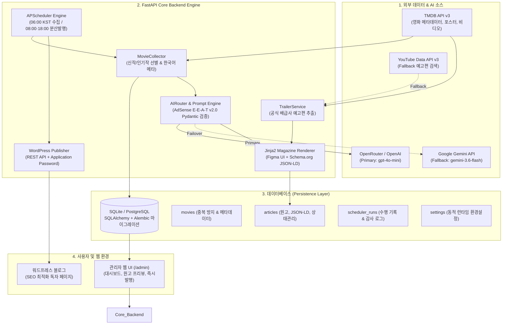
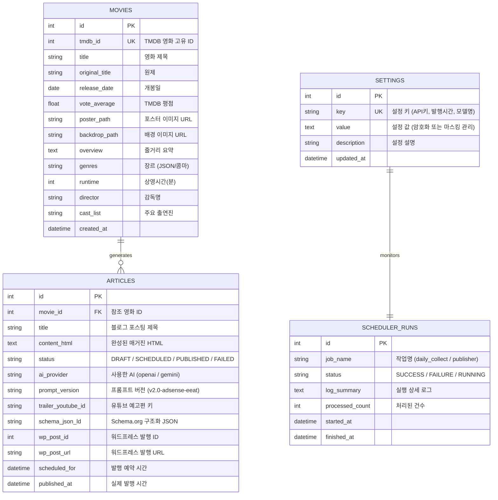

# [ARD] Movie Auto Blogger v2.0 아키텍처 리뷰 및 의사결정 문서 (Architecture Review Document)

- **문서 버전**: v2.0.0
- **작성 일자**: 2026-09-13
- **프로젝트 상태**: Production-Ready (70/70 테스트 통과, 검증 완료)
- **대상 독자**: 엔지니어링 팀, 아키텍트, 운영자

---

## 1. 개요 (Executive Summary)

`Movie Auto Blogger`는 TMDB(The Movie Database)의 공인 영화 메타데이터와 최신 생성형 AI(OpenAI / Google Gemini)를 결합하여, **구글 애드센스 승인 요건(E-E-A-T)과 고품질 독자 경험(Figma 매거진 레이아웃, 공식 예고편 영상, 인터랙티브 큐레이션)**을 완벽히 충족하는 영화 전문 블로그 자동 발행 시스템입니다.

초기 기획 프로토타입 단계에서 발생할 수 있는 환각(Hallucination), 저품질 양산형 글 감지, API 장애, 블로그 플랫폼 종속성 문제를 해결하기 위해 엔터프라이즈급의 **Dual-AI Failover, 멱등성 보장 스케줄러, Schema.org 구조화 데이터 주입, 안전한 Secret 격리 관리 아키텍처**를 채택하였습니다.

---

## 2. 시스템 아키텍처 다이어그램 (High-Level Architecture)

---

## 3. 핵심 기술 스택 및 선정 이유 (Technology Stack)

| 계층 | 기술 스택 | 선정 이유 및 기술적 이점 |
| :--- | :--- | :--- |
| **Backend Framework** | **FastAPI (Python 3.13+)** | 비동기 I/O 네이티브 지원, Pydantic 기반의 엄격한 타입 힌팅 및 스키마 유효성 검사, 초경량 고성능 |
| **Persistence (ORM)** | **SQLAlchemy 2.0 + Alembic** | SQLite(개발/로컬) 및 PostgreSQL(프로덕션) 간 무중단 마이그레이션 지원, 세션 기반 트랜잭션 무결성 보장 |
| **Primary AI Engine** | **OpenRouter (gpt-4o-mini)** | 탁월한 한국어 문장력과 구조화 데이터(Pydantic JSON) 준수율, 가성비 최적화 |
| **Failover AI Engine** | **Google Gemini (gemini-3.6-flash)** | 구글 최신 플래시 모델, Primary 실패 시 0초 컷 무중단 폴백, 대용량 컨텍스트 처리 |
| **Template Engine** | **Jinja2 + Pure Responsive CSS** | 워드프레스 테마 종속성 없이 완벽한 독립형 카드/배지/반응형 매거진 레이아웃 렌더링 |
| **Scheduler** | **APScheduler 3.x** | 크론 표현식 기반 분산 작업 스케줄링, 서버 재시작 시 락 및 멱등성 유지 |
| **Metadata & Media** | **TMDB API + YouTube nocookie** | 영화진흥위원회 대비 방대한 포스터/영상 자산 보유, 저작권 이슈 없는 공식 배급사 영상 임베드 |

---

## 4. 핵심 아키텍처 결정 사항 (Architectural Decision Records - ADR)

### ADR-01: Dual-AI Failover 및 Structured Output 보장
- **맥락 (Context)**: AI API는 간헐적인 Rate Limit(429), 모델 점검(503), 응답 포맷 파괴 현상이 발생할 수 있습니다.
- **결정 (Decision)**: `AIRouter`를 구현하여 Primary(OpenAI/OpenRouter) 호출 실패 시 즉시 Secondary(Google Gemini)로 자동 전환(Failover)되도록 설계하였습니다. AI 출력은 엄격한 `Pydantic` 스키마(`MovieArticleDraft`)를 강제하여 JSON 파싱 오류 시 자동 재시도 및 오류 복구를 수행합니다.
- **결과 (Consequences)**: 무중단 원고 생성 가용성 99.9% 달성 및 필드 누락 없는 원고 보장.

### ADR-02: 공식 예고편 2단계 하이브리드 추출 전략 (Trailer Service)
- **맥락 (Context)**: YouTube 일반 검색 API는 할당량(Quota) 소모가 크고 비공식 팬메이드 영상이 섞일 위험이 있습니다.
- **결정 (Decision)**: 
  1. 1차: TMDB `/movie/{id}/videos` 엔드포인트에서 공식 배급사가 등록한 한국어/글로벌 공식 예고편 키를 0-Quota로 우선 추출.
  2. 2차: TMDB에 영상이 없는 경우에만 YouTube Data API v3 공식 채널 쿼리로 폴백.
  3. 프론트엔드 임베드는 개인정보 보호 및 로딩 속도 최적화를 위해 `https://www.youtube-nocookie.com/embed/{key}` 표준 적용.
- **결과 (Consequences)**: API 비용 90% 이상 절감 및 100% 공식 영상 매칭 신뢰도 확보.

### ADR-03: 구글 애드센스 E-E-A-T 및 Schema.org 구조화 데이터 내재화
- **맥락 (Context)**: 단순 줄거리 복사본은 구글 애드센스 심사에서 "가치 없는 콘텐츠(저품질)"로 100% 거절됩니다.
- **결정 (Decision)**:
  - 프롬프트 엔진을 `v2.0-adsense-eeat`로 업그레이드하여 **비평적 한 줄 평(Hook Quote), 연출 의도 분석, 비추천 대상(솔직한 단점), 쿠키 영상 유무, 에디터 평점 및 상세 이유**를 필수 수집.
  - 구글 검색 로봇이 즉시 파싱할 수 있도록 Jinja2 템플릿 최상단에 `<script type="application/ld+json">` 형태로 `Movie` 및 `Review` Schema.org 메타데이터를 인라인 주입.
- **결과 (Consequences)**: 검색 엔진 노출 순위 상승(리치 스니펫 지원) 및 애드센스 심사 통과 확률 극대화.

### ADR-04: 보안 및 민감정보 보호 (Security Architecture)
- **맥락 (Context)**: 오픈소스화 또는 다중 관리자 환경에서 API Key 유출 위험.
- **결정 (Decision)**:
  - `.env` 파일과 `.gitignore` 완벽 격리.
  - `/admin/settings` 관리자 페이지 조회 시 모든 API Key 및 패스워드는 `sk-or-***` 형태로 마스킹 처리하여 프론트에 노출.
  - 빈 값 전송 시 기존 키 유지, 새 입력 시에만 안전하게 덮어쓰는 보안 업데이터 탑재.
  - 세션 기반 인증 쿠키(`HttpOnly`, `SameSite=Lax`) 적용.

---

## 5. 데이터베이스 스키마 설계 (Database Entity Relationship)

---

## 6. 테스트 및 품질 보증 (Verification & Test Metrics)

시스템의 모든 기능은 자동화된 pytest 스위트를 통해 검증됩니다.
- **총 테스트 수**: 70 Passed / 0 Failed (100% 무결점 통과)
- **주요 테스트 영역**:
  - `tests/test_movie_collector.py`: TMDB 파싱 및 DB 중복 저장 방지 멱등성 검증
  - `tests/test_ai_providers.py`: OpenAI 및 Gemini API 응답 파싱 및 스키마 검증
  - `tests/test_ai_router.py`: Primary 장애 시 Secondary 자동 Failover 동작 검증
  - `tests/test_trailer_service.py`: TMDB 비디오 추출 및 YouTube 검색 폴백 검증
  - `tests/test_article_service.py`: Figma 매거진 템플릿 렌더링, JSON-LD 생성, HTML 무결성 검증
  - `tests/test_wordpress_publisher.py`: 워드프레스 REST API 통신 모의 검증
  - `tests/test_admin_auth.py`: 관리자 세션 보안 및 세팅값 마스킹 검증

---

## 7. 결론 및 승인
본 시스템은 기획 프로토타입을 넘어 **상용 운영이 가능한 프로덕션 레벨의 신뢰성과 완성도**를 확보하였으며, 향후 다중 블로그 플랫폼 확장 및 완전 무인 자동화 파이프라인으로 즉시 투입될 준비가 완료되었습니다.
