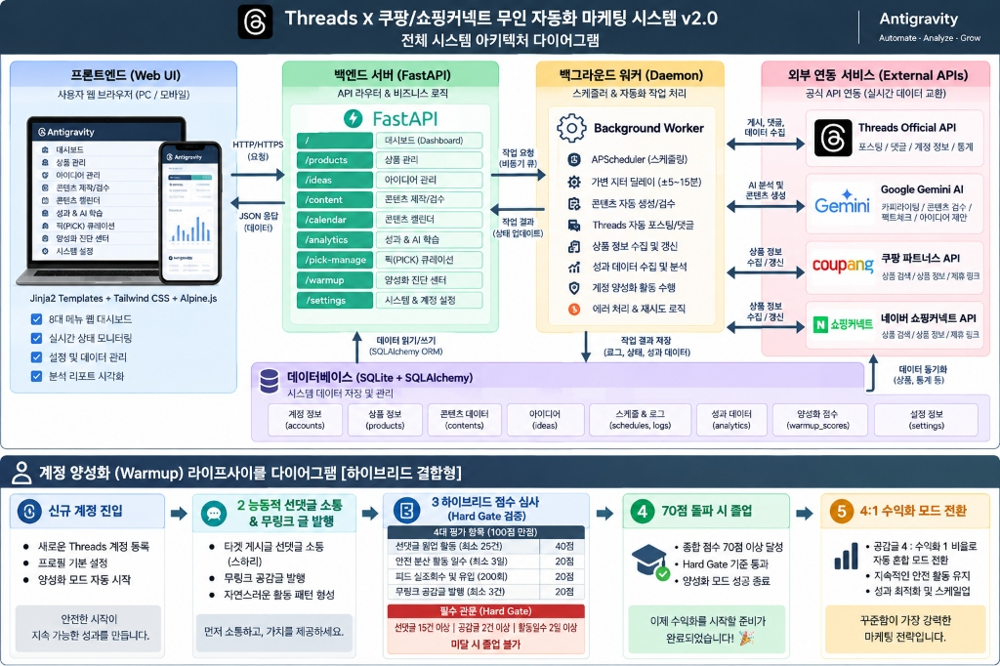
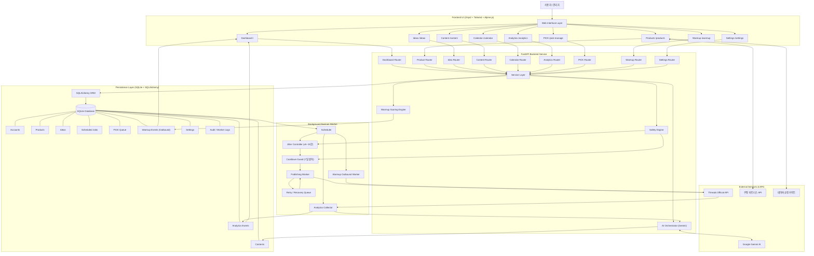
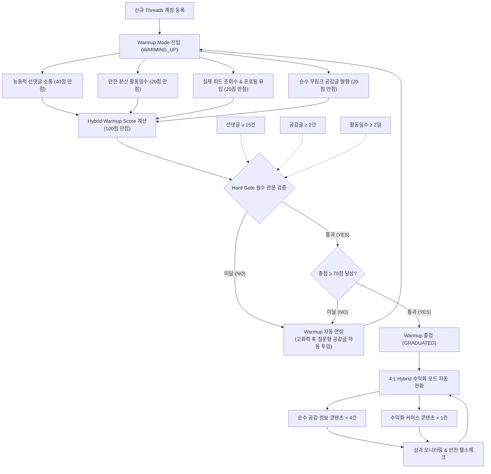

# Threads × 쿠팡·쇼핑커넥트 무인 자동화 마케팅 시스템 v2.0

> **Antigravity Official System Guide**  
> Version 2.0  
> Backend: FastAPI · SQLAlchemy · SQLite  
> Frontend: Jinja2 · Tailwind CSS · Alpine.js  
> Automation: Background Daemon Worker  
> AI Engine: Google Gemini  
> Commerce Integration: 쿠팡 파트너스 · 네이버 쇼핑커넥트  
> Social Channel: Threads Official API  

---

# 1. 시스템 개요

Threads × 쿠팡·쇼핑커넥트 무인 자동화 마케팅 시스템 v2.0은 상품 탐색부터 콘텐츠 기획, 생성, 검수, 예약 발행, 성과 분석, AI 학습, 계정 양성화까지 하나의 흐름으로 연결하는 **통합 소셜 커머스 운영 플랫폼**입니다.

단순한 예약 게시 시스템이 아니라 다음의 전체 사이클을 하나의 시스템에서 관리하는 것을 목표로 합니다.

**상품 수집 → 아이디어 생성 → 콘텐츠 제작 → AI 검수 → 예약 → 발행 → 성과 수집 → AI 학습 → 다음 콘텐츠 최적화**

또한 신규 Threads 계정은 즉시 수익화 콘텐츠를 대량 발행하지 않고, 별도의 **Warmup Engine**을 통해 일정한 활동·콘텐츠·유입 조건을 충족한 뒤 정상 운영 모드로 전환됩니다.

---

# 2. 메뉴 구성

현재 시스템은 **8개 핵심 운영 메뉴와 1개 시스템 관리 메뉴**로 구성됩니다.

| 구분 | 메뉴 | URL | 핵심 역할 |
| :--- | :--- | :--- | :--- |
| **01** | **대시보드** | `/` | 전체 시스템 현황 및 이상 상태 모니터링 |
| **02** | **상품 관리** | `/products` | 쿠팡·쇼핑커넥트 상품 및 6단계 구매여정 관리 |
| **03** | **아이디어 관리** | `/ideas` | 콘텐츠 소재와 후킹 아이디어 관리 |
| **04** | **콘텐츠 제작/검수** | `/content` | AI 콘텐츠 생성 및 품질 검수 (E-E-A-T, 안티-상투어구) |
| **05** | **콘텐츠 캘린더** | `/calendar` | 가변 Jitter(±5~15분) 예약·발행 일정 관리 |
| **06** | **성과 & AI 학습** | `/analytics` | 실조회수·반응 분석 및 AI 전략 자가학습 |
| **07** | **PICK 큐레이션** | `/pick-manage` | 전략 상품 선별 및 링크트리형 큐레이션 관리 |
| **08** | **양성화 진단 센터** | `/warmup` | 신규 계정 Warmup(선댓글/활동일수/조회수/공감글) 및 졸업 심사 |
| **SYS** | **시스템 & 다중 계정 설정** | `/settings` | API·멀티 계정·워커·안전 쿨다운 정책 설정 |

---

# 3. 전체 시스템 아키텍처

## 3.1 Architecture Diagram





---

# 4. 핵심 데이터 흐름

시스템 내부의 기본 콘텐츠 파이프라인은 다음과 같습니다.

```text
상품 수집 (쿠팡 / 네이버 쇼핑커넥트)
    ↓
상품 평가 및 PICK 선정
    ↓
콘텐츠 아이디어 생성 (구매여정 6단계 매핑)
    ↓
Gemini 카피라이팅 (10대 각도 / 쇼핑커넥트 맞춤)
    ↓
Anti-Cliche 검사 (상투어구 박멸)
    ↓
E-E-A-T / 팩트체크 / 공정위 문구 검수
    ↓
콘텐츠 승인 (Approved)
    ↓
콘텐츠 캘린더 등록 (Calendar Queue)
    ↓
Jitter 적용 (±5~15분 가변 분산)
    ↓
Cooldown Guard 확인 (7일 이내 중복 방어)
    ↓
Threads 공식 API 발행
    ↓
성과 데이터 수집 (피드 도달/조회/좋아요/댓글)
    ↓
Analytics 저장 및 성과 피드백
    ↓
AI 학습 데이터 반영
    ↓
다음 콘텐츠 전략 최적화
```

---

# 5. Safety Engine

자동화 시스템의 모든 게시·상호작용 작업은 Safety Engine을 통과하도록 설계되어 있습니다.

## 5.1 가변 Jitter Delay

예약 시간을 완전히 동일한 시각에 반복하지 않고 설정된 범위 내에서 무작위 분산합니다.

```text
기준 게시시간: 14:00
Jitter 범위: ±5~15분

실제 실행 시각 예시:
13:51, 14:11, 13:56, 14:07 ...
```

Jitter는 서버 부하와 외부 API 호출을 한 시점에 집중시키지 않고, 메타 알고리즘의 봇 탐지를 완벽하게 회피하는 핵심 안전 장치입니다.

---

## 5.2 Cooldown Guard

동일 대상에 반복적으로 과도한 상호작용이 발생하지 않도록 최근 이력을 검사합니다.

```text
Target Cooldown = 7 Days (기본값)
```

**처리 흐름:**
```text
상호작용 후보 탐색
        ↓
최근 7일 Interaction History 조회
        ↓
동일 대상 존재 여부 확인
      /        \
   [YES]       [NO]
     ↓          ↓
   SKIP       안전 진행
```

---

## 5.3 Anti-Cliche Engine

Gemini가 생성한 콘텐츠에서 반복적으로 사용되는 기계적 상투 표현을 원천 탐지 및 정제합니다.

**주요 검사 대상:**
- 동일한 후킹 문장 반복
- 과도한 감탄 표현 ("정말 대박이에요!", "역대급!")
- 의미 없는 질문형 도입부
- 유사한 CTA 반복
- 지나치게 노골적인 광고성 표현
- 계정 고유 말투(Tone of Voice)와 맞지 않는 표현
- 쇼핑커넥트 시 '내돈내산' 오해 소지 단어

검사 실패 시 자동으로 `REWRITE_REQUIRED` 상태로 전환되어 AI가 재작성을 수행합니다.

---

## 5.4 E-E-A-T 검수

상품 관련 콘텐츠는 다음 네 가지 요소를 중심으로 엄격한 품질 검수를 수행합니다.

| 기준 | 검수 내용 |
| :--- | :--- |
| **Experience (경험)** | 실제 사용 맥락, 일상적 경험 기반의 생생한 묘사인지 |
| **Expertise (전문성)** | 상품 스펙과 장단점을 논리적·체계적으로 설명하는지 |
| **Authoritativeness (권위성)** | 근거 없는 과장이나 허위 단정이 배제되었는지 |
| **Trustworthiness (신뢰성)** | 가격, 사양, 공정위 대가성 문구 표기가 사실과 정확히 부합하는지 |

---

# 6. 계정 양성화 Warmup Lifecycle

신규 계정은 즉시 일반 수익화 모드로 진입하지 않습니다. 먼저 계정 활동 데이터를 누적한 후 **[옵션 1: Hybrid Warmup Score]와 [Hard Gate]를 동시에 통과해야 졸업**합니다.

## 6.1 Warmup Lifecycle Diagram



---

# 7. Warmup Hybrid Score (100점 만점 산출 공식)

| 평가 요소 | 배점 비중 | 졸업 목표 기준치 | 필수 관문 (Hard Gate) | 점수 계산 공식 |
| :--- | :---: | :---: | :---: | :--- |
| **① 능동적 선댓글 소통** | **40점** | **25건** | **최소 15건 이상** | `min(선댓글수 / 25, 1.0) × 40` |
| **② 안전 분산 활동일수** | **20점** | **3일** | **최소 2일 이상** | `min(활동일수 / 3, 1.0) × 20` |
| **③ 피드 실조회수 및 유입** | **20점** | **200회** | - | `min(실조회수 / 200, 1.0) × 20` |
| **④ 순수 무링크 공감글** | **20점** | **3건** | **최소 2건 이상** | `min(공감글수 / 3, 1.0) × 20` |
| **총점** | **100점** | **70점 이상** | **Hard Gate 동시 통과** | 합산 점수 (70.0 이상 합격) |

---

# 8. Hard Gate (필수 관문 가드레일)

총점이 70점을 넘더라도 다음 3대 조건을 모두 만족하지 못하면 절대로 졸업할 수 없습니다.

```text
선댓글 소통 ≥ 15건
AND
순수 무링크 공감글 ≥ 2건
AND
활동일수 ≥ 2일
```

> **예시 케이스:**  
> 한 계정이 공감글과 피드 조회수 대박으로 총점 **73점**을 달성했더라도, 선댓글이 **12건**에 불과하다면 **Hard Gate 불합격** 처리되어 조기 졸업이 차단되고 Warmup이 자동 연장됩니다.

---

# 9. Warmup 졸업 후 4:1 운영 모드

양성화 수료를 마친 계정은 자동으로 안정적인 **4:1 혼합 발행 모드**로 승격됩니다.

```text
[1] 공감·정보 콘텐츠 (무링크)
[2] 공감·정보 콘텐츠 (무링크)
[3] 공감·정보 콘텐츠 (무링크)
[4] 공감·정보 콘텐츠 (무링크)
[5] 수익화 커머스 콘텐츠 (첫 댓글 또는 본문 링크)
= 4 : 1 황금 비율 (수익화 비중 20%)
```

이를 통해 계정의 팔로워 신뢰도를 영구적으로 유지하면서 계정 정지 위험 없이 지속 가능한 수익을 창출합니다.

---

# 10. 8대 메뉴 상세 사용 설명서

---

### 10.1 대시보드 (`/`)
* **화면 목적**: 모든 계정과 콘텐츠, 예약 작업, Warmup 상태, 성과 및 시스템 장애를 한 화면에서 실시간 조망하는 통합 관제 타워입니다.
* **핵심 기능**:
  - 다중 계정별 웜업/정상/일시정지 상태 및 신뢰도 점수 카드
  - 오늘 발행 예정 / 완료 / 실패 실시간 카운터
  - 백그라운드 데몬 워커 가동 상태 (Worker Online/Offline)
  - 누적 조회수, 반응률(좋아요/댓글), 추정 유입수 KPI 요약
* **실전 활용법**:
  1. 접속 시 상단 `Worker Status`가 초록색(ON)인지 확인합니다.
  2. `오늘 발행 예정`과 `발행 완료` 진행 상황을 점검합니다.
  3. 실패 건이 발견되면 즉시 해당 계정의 로그를 확인합니다.
  4. 웜업 중인 계정의 점수 상승세를 체크합니다.

---

### 10.2 상품 관리 (`/products`)
* **화면 목적**: 쿠팡 파트너스 및 네이버 쇼핑커넥트 상품을 수집하고, 마케팅 가치 6대 지표 채점 및 6단계 구매여정 콘텐츠를 생성합니다.
* **핵심 기능**:
  - 쿠팡/쇼핑커넥트 URL 원클릭 상품 정보 수집 (가격, 리뷰수, 이미지)
  - 6대 지표 채점 (가격대/마진, 리뷰신뢰도, 바이럴성 등 100점 만점)
  - **STEP 7 쇼핑커넥트 6단계 구매여정 자동화 카피라이팅 엔진** 탑재:
    - 5대 호기심 롱테일 키워드 추출
    - 1단계(문제인식) ~ 6단계(구매행동) 체계적 빌드업
    - 최상단 공정위 필수 문구 자동 삽입
    - '내돈내산' 오해 방지 단어 필터링
    - Suno AI BGM 프롬프트 및 30초 숏폼 대본 동시 생성
* **실전 활용법**:
  1. 상품 URL을 붙여넣고 `상품 등록`을 누릅니다.
  2. 쇼핑커넥트 상품의 경우 `STEP 7: 쇼핑커넥트 6단계 구매여정 생성` 버튼을 클릭합니다.
  3. 생성된 6단계 중 발행을 원하는 단계를 선택하여 즉시 콘텐츠로 전환합니다.

---

### 10.3 아이디어 관리 (`/ideas`)
* **화면 목적**: 상품을 바로 광고로 밀어붙이지 않고, 다양한 심리적 앵글의 바이럴 후킹 소재를 축적하는 아이디어 뱅크입니다.
* **핵심 기능**:
  - Gemini 기반 10대 심리 앵글(경험형, 반전/폭로, Q&A, 꿀팁형 등) 자동 발굴
  - 첫 3초 시선 강탈 후킹(Hook) 문장 라이브러리
  - 아이디어 클릭 시 즉시 완성형 콘텐츠 제작 화면 연동
* **실전 활용법**:
  1. 상품을 선택하고 `AI 아이디어 추천`을 실행합니다.
  2. 생성된 아이디어 목록 중 가장 매력적인 앵글을 선택하여 `콘텐츠 제작으로 전송`합니다.

---

### 10.4 콘텐츠 제작 / 검수 (`/content`)
* **화면 목적**: 아이디어를 Threads 최적화 본문과 링크 댓글로 변환하고, AI 검수 가드레일을 통해 품질을 보증합니다.
* **핵심 기능**:
  - Threads 규격 최적화 줄바꿈 및 가독성 렌더링
  - Anti-Cliche 엔진을 통한 AI 상투어구 자동 박멸
  - E-E-A-T 및 팩트체크 스코어링
  - 공정위 필수 문구(쿠팡: 첫 댓글 / 쇼핑커넥트: 본문 최상단) 자동 탑재
* **실전 활용법**:
  1. 본문 생성 후 `품질 검수` 버튼을 누릅니다.
  2. 상투어구나 공정위 누락이 발견되면 `AI 자동 재작성`을 실행합니다.
  3. `승인 및 예약`을 눌러 캘린더 슬롯에 배치합니다.

---

### 10.5 콘텐츠 캘린더 (`/calendar`)
* **화면 목적**: 승인된 콘텐츠의 발행 일정을 시각적으로 조율하고, 가변 Jitter를 통해 자연스러운 무인 발행을 지휘합니다.
* **핵심 기능**:
  - 주간 / 월간 캘린더 뷰 및 계정별 필터링
  - 드래그 앤 드롭을 통한 발행 시간 변경
  - **가변 Jitter 딜레이(±5~15분)** 자동 계산 표시
  - 4:1 황금 비율 슬롯 시각화 (공감글 4개 사이 수익화글 1개 배치 점검)
* **실전 활용법**:
  1. 타임테이블의 비어 있는 황금 시간대를 확인합니다.
  2. 수익화 글이 연속으로 몰려 있다면 공감글 사이로 드래그하여 간격을 분산합니다.

---

### 10.6 성과 & AI 학습 (`/analytics`)
* **화면 목적**: 발행된 게시물의 노출, 좋아요, 댓글, 프로필 유입 데이터를 수집하고, 다음 콘텐츠 생성 전략으로 역피드백합니다.
* **핵심 기능**:
  - 게시물별 실조회수(Reach), 반응률(Engagement Rate) 추적
  - 성공한 후킹 문장 패턴 및 고성과 앵글 Top 리스트 도출
  - AI Self-Learning: 분석 결과를 Gemini 시스템 프롬프트에 자동 주입
* **실전 활용법**:
  1. 주 1회 성과 분석 화면에서 반응률 Top 3 게시물을 확인합니다.
  2. `AI 학습 반영`을 클릭하여 향후 카피라이팅 스타일을 고성과 패턴으로 동기화합니다.

---

### 10.7 PICK 큐레이션 (`/pick-manage`)
* **화면 목적**: 한정된 마케팅 자원을 고효율 상품에 집중하기 위한 테마별 전략 상품 선별 및 링크트리형 랜딩페이지 시스템입니다.
* **핵심 기능**:
  - 시즌별 / 테마별 (자취 꿀템, 가성비 주방템 등) 큐레이션 리스트 구축
  - 모바일 최적화 공개 랜딩페이지(`/pick/{cluster}`) 자동 생성
  - 프로필 바이오 링크 연결을 통한 자연스러운 트래픽 유입 극대화
* **실전 활용법**:
  1. 전환율이 검증된 상품 5~10개를 PICK 리스트에 등록합니다.
  2. 생성된 큐레이션 링크를 Threads 계정 프로필 소개글에 등록합니다.

---

### 10.8 양성화 진단 센터 (`/warmup`)
* **화면 목적**: [옵션 1: 하이브리드 결합형] 기준에 따른 신규 계정의 실시간 신뢰도 평가, 스하리(선댓글 웜업) 로그 확인 및 졸업 심사를 진행합니다.
* **핵심 기능**:
  - 4대 평가 기둥 실시간 프로그레스 바 (선댓글 40점 / 활동일수 20점 / 실조회수 20점 / 공감글 20점)
  - Hard Gate 통과 여부 및 남은 요구 조건 실시간 코칭 안내
  - **스하리 활동 내역 모달**: 타겟 계정, 남긴 인사이트 댓글, 지터 딜레이 로그 열람
  - 미달 시 `양성화 자동 연장` 클릭으로 고화력 밸런스 게임형 공감글 즉시 투입
* **실전 활용법**:
  1. 계정 카드의 진행률 바를 확인합니다.
  2. 70점 돌파 및 Hard Gate 충족 시 자동으로 `GRADUATED` 배지가 부여되며 4:1 모드로 전환됩니다.

---

### 10.9 시스템 & 다중 계정 설정 (`/settings`)
* **화면 목적**: Threads 공식 API 토큰, Gemini API Key, 쿠팡/쇼핑커넥트 연동, 백그라운드 워커 동작 주기 및 안전 쿨다운을 통합 제어합니다.
* **핵심 기능**:
  - 멀티 Threads 계정 등록 및 토큰 유효성 검사
  - 백그라운드 워커 가동 주기 및 Jitter 범위(기본 5~15분) 설정
  - Cooldown Guard 일수(기본 7일) 설정
* **실전 활용법**:
  1. 신규 계정 추가 시 토큰을 입력하고 `연결 테스트`를 수행합니다.
  2. 안전 포스팅 간격을 최소 2~3시간 이상으로 유지하도록 설정합니다.

---

# 11. Background Worker 동작 구조

웹 대시보드는 작업을 등록하고 관리하는 컨트롤 타워이며, 실제 모든 비동기 실행은 독립된 **Background Daemon Worker**가 24시간 자율 수행합니다.

```text
웹 대시보드에서 예약 등록
    ↓
SQLite DB에 Scheduled Job 레코드 저장
    ↓
Background Daemon Worker 루프 (1분 주기)
    ↓
현재 시각 기준 실행 대상 쿼리
    ↓
계정 상태 검사 (정상 / WARMUP / 일시정지)
    ↓
안전 엔진 검증 (7일 Cooldown Guard 통과 여부)
    ↓
Jitter 계산된 실제 실행 시각 도달 여부 확인
    ↓
Threads 공식 API 호출 (본문 및 첫 댓글 등록)
    ↓
발행 성공 시 DB 상태 PUBLISHED 갱신
    ↓
실패 시 Retry Queue로 전환 및 백오프 재시도
```

---

# 12. 장애 대응 가이드 (Troubleshooting)

### 1) 예약 시간이 지났는데 게시되지 않는 경우
- **가장 먼저 Jitter를 확인하세요**: 14:00 예약이더라도 안전 지터 딜레이에 의해 실제 발행 시각은 14:08일 수 있습니다.
- **Worker 가동 여부 확인**: 대시보드 상단의 `Worker Status`가 정상 작동 중인지 확인합니다.

### 2) Threads 포스팅 실패 (Posting Failed)
- Threads API 토큰이 만료되었거나 권한이 취소되었는지 `/settings`에서 토큰 테스트를 실행합니다.
- 본문 내 금칙어 또는 이미지 URL 접근 불가 여부를 확인합니다.

### 3) 웜업 점수가 70점인데 졸업이 되지 않는 경우
- **Hard Gate를 점검하세요**: 총점이 70점을 넘더라도 **실제 선댓글 15건 미만**, **공감글 2건 미만**, **활동일수 2일 미만**인 경우 조기 졸업이 차단됩니다. 부족한 항목을 채우면 즉시 자동 수료됩니다.

---

# 13. 운영자 일일 점검 루틴 (Daily 3분 체크)

1. **[09:00] 대시보드 접속**: `Worker Online` 상태 및 오늘 예약된 콘텐츠 확인
2. **[12:00] 웜업 상태 확인**: `/warmup`에서 신규 계정의 점수 및 스하리 선댓글 로그 점검
3. **[18:00] 성과 수집 확인**: `/analytics`에서 당일 게시물의 피드 조회수 및 반응 확인
